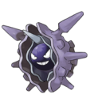
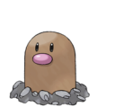
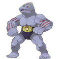
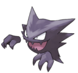
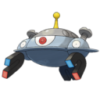

<!DOCTYPE html>
<html lang="cs">
<head>
    <meta charset="UTF-8">
    <meta http-equiv="X-UA-Compatible" content="IE=edge">
    <meta name="viewport" content="width=device-width, initial-scale=1.0">
    <link rel="stylesheet" href="https://cdn.jsdelivr.net/npm/bootstrap@4.6.0/dist/css/bootstrap.min.css" integrity="sha384-B0vP5xmATw1+K9KRQjQERJvTumQW0nPEzvF6L/Z6nronJ3oUOFUFpCjEUQouq2+l" crossorigin="anonymous">
    <link rel="stylesheet" href="bootstrap.css">
    <link rel="preconnect" href="https://fonts.gstatic.com">
    
    
    <title>Pokemoni</title>
</head>
<body>
    <nav class="navbar sticky-top navbar-expand-lg navbar-dark bg-primary">
        <a class="navbar-brand">Pokemon</a>
        <button class="navbar-toggler" type="button" data-toggle="collapse" data-target="#navbarSupportedContent" aria-controls="navbarSupportedContent" aria-expanded="false" aria-label="Toggle navigation">
          
        </button>
        

          <ul class="navbar-nav mr-auto">
            <li class="nav-item active">
              <a class="nav-link" href="#">Domů (current)</a>
            </li>
            <li class="nav-item active">
              <a class="nav-link" href="Historie/historie.html">Historie</a>
            </li>
            <li class="nav-item active dropdown">
              <a class="nav-link dropdown-toggle" href="#" id="navbarDropdown" role="button" data-toggle="dropdown" aria-haspopup="true" aria-expanded="false">
                Odvětví
              </a>
              

                <a class="dropdown-item" href="Klasika/klasika.html">Klasika</a>
                

                <a class="dropdown-item" href="PVP/pvp.html">Pokemon PVP</a>
                <a class="dropdown-item" href="MMO/mmo.html">Pokemon MMO</a>
              

            </li>
          </ul>
           
        

    </nav>

    <main class="container">
            
        

            

                

                    <h1 class="display-4">Přejdi do světa pokemonů</h1>
                    
Ve světě pokemenů žijí pokemoni a lidé v míru. Lidé používají pokémony jako své mazlíčky. Starají se o ně. Trénují je a pak s nimi zápasí. Pokémoni mají ve světě obří popularitu ať už jejich seriály, hry, karty, oblečení a vlastně všechno co vás napadne.

                    

                    
Pokemoní zápasy jsou hlavní část jak seriálů tak her. Hlavní faktory pro dosažení výhry jsou výhoda typu, level, vývin, vhodné pole útoků.

                    <a class="btn btn-primary btn-lg" href="Základy bojů/zápasy.html" role="button">Chci vědět víc</a>
                

            

            

                <form class="mb-5 mt-md-5">
                    

                      <label for="exampleInputEmail1">Email</label>
                      <input type="email" class="form-control" id="exampleInputEmail1" aria-describedby="emailHelp" placeholder="name@example.com">
                    

                    

                      <label for="exampleInputPassword1">Heslo</label>
                      <input type="password" class="form-control" id="exampleInputPassword1" placeholder="Musí mít alespoň 8 znaků">
                    

                    

                      <input type="checkbox" class="form-check-input" id="exampleCheck1">
                      <label class="form-check-label" for="exampleCheck1">nejsem robot</label>
                    

                    <button type="submit" class="btn btn-primary">Přihlásit se</button>
                </form>
            

        

            

                <h1>Pokédex</h1>
                
Pokédex je univerzální příručka pro trenéry pokémonů. Obsahuje důležité a zajímavé informace o pokémonech jako jejich jméno, typ, fáze vývinu. Zde je pár odstřižků z něj.

                

                    

                        

                            
                            

                              <h5 class="card-title">Cloyster</h5>
                              

                                  <b>Typ:</b> lední, vodní  
                                  <b>Kategorie:</b> škeble  
                                  <b>Váha:</b> 132kg
                              

                              <a href="https://www.pokemon.com/us/pokedex/cloyster" class="btn btn-primary">Originální zdroj z pokédexu</a>
                            

                          

                    

                    

                        

                            
                            

                              <h5 class="card-title">Diglett</h5>
                              

                                  <b>Typ:</b> zemní  
                                  <b>Kategorie:</b> krtek  
                                  <b>Váha:</b> 0.8kg
                              

                              <a href="https://www.pokemon.com/us/pokedex/diglett" class="btn btn-primary">Originální zdroj z pokédexu</a>
                            

                          

                    

                    

                        

                            
                            

                              <h5 class="card-title">Snorlax</h5>
                              

                                  <b>Typ:</b> normální  
                                  <b>Kategorie:</b> spáč  
                                  <b>Váha:</b> 460kg
                              

                              <a href="https://www.pokemon.com/us/pokedex/snorlax" class="btn btn-primary">Originální zdroj z pokédexu</a>
                            

                          

                    

                

                  

                    

                        

                            
                            

                              <h5 class="card-title">Machoke</h5>
                              

                                  <b>Typ:</b> bojový  
                                  <b>Kategorie:</b> supersilák  
                                  <b>Váha:</b> 70kg
                              

                              <a href="https://www.pokemon.com/us/pokedex/machoke" class="btn btn-primary">Originální zdroj z pokédexu</a>
                            

                          

                    

                    

                        

                            
                            

                              <h5 class="card-title">Haunter</h5>
                              

                                  <b>Typ:</b> duchový, jedovatý  
                                  <b>Kategorie:</b> plyn  
                                  <b>Váha:</b> 0.09kg
                              

                              <a href="https://www.pokemon.com/us/pokedex/haunter" class="btn btn-primary">Originální zdroj z pokédexu</a>
                            

                          

                    

                    

                        

                            
                            

                              <h5 class="card-title">Magnezone</h5>
                              

                                  <b>Typ:</b> elektrický, železný  
                                  <b>Kategorie:</b> magnet  
                                  <b>Váha:</b> 180kg
                              

                              <a href="https://www.pokemon.com/us/pokedex/magnezone" class="btn btn-primary">Originální zdroj z pokédexu</a>
                            

                          

                    

                  

            

    </main>

<!-- Footer -->
<footer class="bg-primary text-center text-lg-start text-white mt-5">
  <!-- Grid container -->
  

    <!--Grid row-->
    

      <!--Grid column-->
      

        <h5 class="text-uppercase">Já a pokemoni</h5>
        

          Jako malý asi od 5 let jsem rád vstával v 6 ráno a sledoval pokémony. Následně jsem začal sbírat pokémony a neustále je vyměnoval s dětma ve škole až do svých 12.
          Nedávno se ale moje zapálení pro pokémony vrátilo když jsem začal hrát pokemon mmo se svým bráchou. Začalo mě bavit pvp. Proto jsem se rozhodl poradit lidem jak začít s pokemony a
          do čeho se pustit. 
        

      

      <!--Grid column-->

      <!--Grid column-->
      

        <h5 class="text-uppercase">Kontakt</h5>

        <ul class="list-unstyled mb-0">
          <li style="margin-bottom: 3%;">
            <a href="mailto:roman.tarnai.020@pslib.cz" class="text-white">roman.tarnai.020@pslib.cz</a>
          </li>
          <li>
            <a class="text-white">Česká republika, Hrádek nad Nisou</a>
          </li>
          <li style="margin-top: 3%;">
            <a class="text-white">704 158 748</a>
          </li>
        </ul>
      

    

    

    <!-- Copyright -->
    

      © 2020 Copyright:
      <a class="text-white">Roman Tarnai</a>
    

    <!-- Copyright -->
  </footer>
  <!-- Footer -->
</body>
</html>
