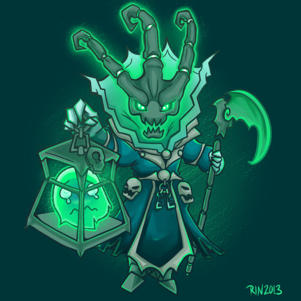

<!DOCTYPE html>
<html lang="en">
<head>
    <meta charset="UTF-8">
    <meta http-equiv="X-UA-Compatible" content="IE=edge">
    <meta name="viewport" content="width=device-width, initial-scale=1.0">
    <link rel="stylesheet" href="https://maxcdn.bootstrapcdn.com/bootstrap/4.0.0/css/bootstrap.min.css" integrity="sha384-Gn5384xqQ1aoWXA+058RXPxPg6fy4IWvTNh0E263XmFcJlSAwiGgFAW/dAiS6JXm" crossorigin="anonymous">
    <link rel="stylesheet" href="bootstrap.css">
    
    <title>Clicker</title>
</head>
<body>
    <main class="container">
    

        <figure class="figure">
            
            <figcaption id="maintxt" class="figure-caption">Sebrané lanterny: 0</figcaption>
            <figcaption id="dmg" class="text-center">DMG = 5</figcaption>
            <figcaption id=lanterny_s class="text-center">Lanterny/s = 0</figcaption>
            <button onclick="saveCookies()" type="button" class="btn btn-primary">Uložit</button>
            <button onclick="loadCookies()" type="button" class="btn btn-primary">Načíst</button>
        </figure>
    

    </main> 
    

        

            
            

              <h5 class="mt-0">Kalista</h5>
              Click DMG +5  
              
koupených kalist: 0
  
              
cena: 100 lantern

              <button onclick="buyKalista()" type="button" class="btn btn-primary">Koupit</button>
            

          

          

            
            

              <h5 class="mt-0">Duše</h5>
              lanterny/s +2  
              
koupených duší: 0
  
              
cena: 150 lantern

              <button onclick="buyDuse()" type="button" class="btn btn-primary">Koupit</button>
            

          

    

</body>
</html>
